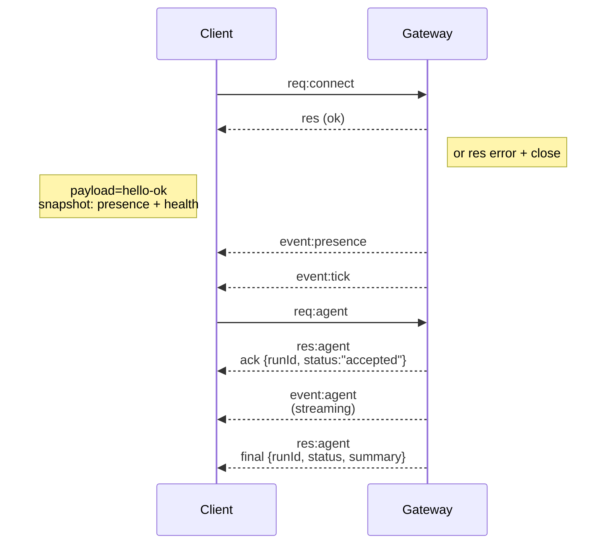

# ゲートウェイアーキテクチャ

最終更新: 2026-01-22

## 概要

- 単一の長期稼働する**Gateway**が、すべてのメッセージングサーフェス（BaileysによるWhatsApp、grammYによるTelegram、Slack、Discord、Signal、iMessage、WebChat）を管理します。
- コントロールプレーンクライアント（macOSアプリ、CLI、Web UI、オートメーション）は、設定されたバインドホスト（デフォルト `127.0.0.1:18789`）上の**WebSocket**経由でGatewayに接続します。
- **Nodes**（macOS/iOS/Android/ヘッドレス）も**WebSocket**経由で接続しますが、明示的なcaps/commandsで `role: node` を宣言します。
- ホストごとに1つのGateway；WhatsAppセッションを開く唯一の場所です。
- **キャンバスホスト**はGatewayのHTTPサーバーによって以下の場所で提供されます：
  - `/__openclaw__/canvas/`（エージェント編集可能なHTML/CSS/JS）
  - `/__openclaw__/a2ui/`（A2UIホスト）
    GatewayのポートをそのままA2UIで使用します（デフォルト `18789`）。

## コンポーネントとフロー

### Gateway（デーモン）

- プロバイダー接続を維持します。
- 型付きWS API（リクエスト、レスポンス、サーバープッシュイベント）を公開します。
- 受信フレームをJSON Schemaに対して検証します。
- `agent`、`chat`、`presence`、`health`、`heartbeat`、`cron` などのイベントを発行します。

### クライアント（macアプリ / CLI / Web管理）

- クライアントごとに1つのWS接続。
- リクエストを送信します（`health`、`status`、`send`、`agent`、`system-presence`）。
- イベントをサブスクライブします（`tick`、`agent`、`presence`、`shutdown`）。

### Nodes（macOS / iOS / Android / ヘッドレス）

- `role: node` で**同じWSサーバー**に接続します。
- `connect` でデバイスIDを提供します；ペアリングは**デバイスベース**（ロール `node`）で、承認はデバイスペアリングストアにあります。
- `canvas.*`、`camera.*`、`screen.record`、`location.get` などのコマンドを公開します。

プロトコルの詳細：

- [Gatewayプロトコル](/gateway/protocol)

### WebChat

- GatewayのWS APIを使用してチャット履歴と送信を行う静的UI。
- リモートセットアップでは、他のクライアントと同じSSH/Tailscaleトンネル経由で接続します。

## 接続ライフサイクル（単一クライアント）



## ワイヤープロトコル（概要）

- トランスポート：WebSocket、JSONペイロードのテキストフレーム。
- 最初のフレームは必ず `connect` であること。
- ハンドシェイク後：
  - リクエスト：`{type:"req", id, method, params}` → `{type:"res", id, ok, payload|error}`
  - イベント：`{type:"event", event, payload, seq?, stateVersion?}`
- `OPENCLAW_GATEWAY_TOKEN`（または `--token`）が設定されている場合、`connect.params.auth.token` が一致しないとソケットが閉じられます。
- 副作用のあるメソッド（`send`、`agent`）には冪等性キーが必要で、安全なリトライのためにサーバーが短期間の重複排除キャッシュを保持します。
- Nodesは `connect` に `role: "node"` とcaps/commands/permissionsを含める必要があります。

## ペアリング + ローカル信頼

- すべてのWSクライアント（オペレーターとNodes）は `connect` に**デバイスID**を含めます。
- 新しいデバイスIDはペアリング承認が必要；Gatewayはその後の接続用に**デバイストークン**を発行します。
- **ローカル**接続（ループバックまたはGatewayホスト自身のtailnetアドレス）は、同一ホストのUXをスムーズにするために自動承認できます。
- すべての接続は `connect.challenge` nonceに署名する必要があります。
- 署名ペイロード `v3` は `platform` + `deviceFamily` もバインドします；Gatewayは再接続時にペアリングメタデータをピン留めし、メタデータの変更には再ペアリングが必要です。
- **非ローカル**接続は依然として明示的な承認が必要です。
- Gatewayの認証（`gateway.auth.*`）は、ローカルかリモートかに関わらず**すべての**接続に適用されます。

詳細：[Gatewayプロトコル](/gateway/protocol)、[ペアリング](/channels/pairing)、[セキュリティ](/gateway/security)。

## プロトコルの型定義とコード生成

- TypeBoxスキーマでプロトコルを定義します。
- JSON SchemaはそのスキーマAから生成されます。
- Swiftモデルは JSON Schema から生成されます。

## リモートアクセス

- 推奨：TailscaleまたはVPN。
- 代替：SSHトンネル

  ```bash
  ssh -N -L 18789:127.0.0.1:18789 user@host
  ```

- 同じハンドシェイク + 認証トークンがトンネル越しに適用されます。
- リモートセットアップではWSのTLS + オプションのピン留めを有効化できます。

## 運用スナップショット

- 起動：`openclaw gateway`（フォアグラウンド、stdoutにログ出力）。
- ヘルス：WS経由の `health`（`hello-ok` にも含まれます）。
- スーパービジョン：自動再起動のためにlaunchd/systemd。

## 不変条件

- 厳密に1つのGatewayがホストごとに単一のBaileysセッションを制御します。
- ハンドシェイクは必須；非JSONまたは非connectの最初のフレームはハードクローズになります。
- イベントは再送されません；クライアントはギャップが生じた場合にリフレッシュする必要があります。
